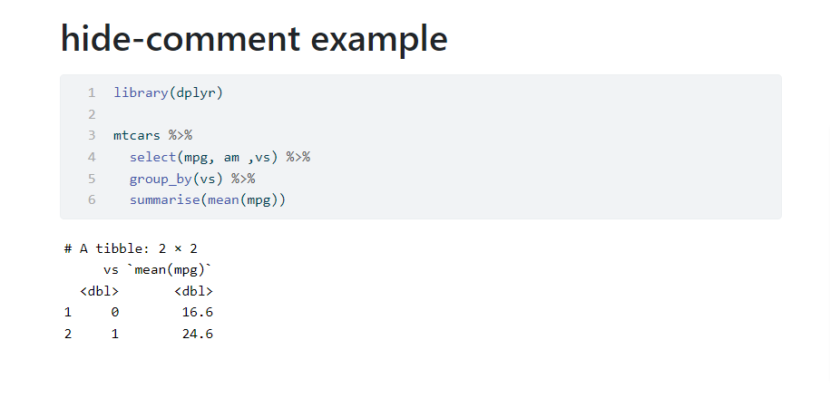

# Hide-comment Extension For Quarto

`hide-comment` is a [Quarto](https://quarto.org/) filter extension that provides comment-directive to hide comment from code chunk in the rendered document (works for html/revealjs/pdf format.)

## Installing

:warning: This extension requires Quarto version to be at least 1.2.

```bash
quarto add shafayetShafee/hide-comment
```

This will install the extension under the `_extensions` subdirectory.
If you're using version control, you will want to check in this directory.

## Using

At first, use the filter in the document yaml section,

```
filters: 
  - hide-comment
```

Now to write a comment that will be hidden from the code chunk in rendered document, you need to use comment-directives. And the syntax of the comment directive depends on the language of the code chunk and therefore, should start with the character(s) that is used to do inline commenting in that programming language.

So for python, R and Julia, it should start with hash symbol `#`. For javascript or ojs or dot chunk, it should start with `//`, for mermaid graph chunk it should start with `%%`. It is because, after all, they should be valid comment line when the document parses.

After deciding on the syntax of comment-directives, enlist them with or under the `comment-directive` yaml option. Then `hide-comment` filter will remove the lines from code chunk that initiates with the enlisted directives.

A simple example as follows,

~~~
---
title: "hide-comment example"
comment-directive: "#>"
filters: 
  - hide-comment
code-line-numbers: true
---


```{r}
#| message: false
#> This is some hidden comment which is visible in code editor
#> but not in rendered documents
library(dplyr) 

#>
#> more hidden comment
mtcars %>% 
  select(mpg, am ,vs) %>% 
  group_by(vs) %>% 
  summarise(mean(mpg))
```
~~~


And the rendered version, 



## Example

Here is the source code for  example: [example.qmd](example.qmd) and [the rendered output](https://shafayetshafee.github.io/hide-comment/example.html)


## Acknowledgement

This extension is largely inspired by another quarto extension [`code-visibility`](https://github.com/jjallaire/code-visibility).
